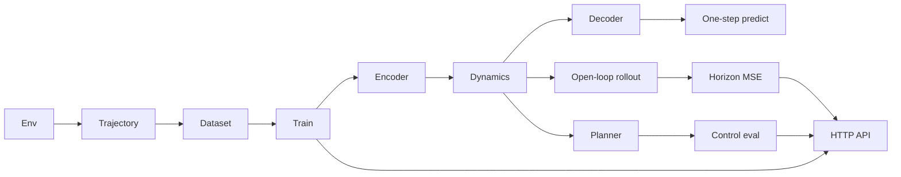

# Architecture

WorldForge is a latent world model for a scientific dynamics sandbox. The
target pipeline learns a compact state from trajectories, rolls it forward,
plans with that model, and scores prediction and control offline. The
environment, the trajectory record, an offline dataset builder, a latent
model, a one-step training loop, an open-loop prediction eval, a
model-based planner, and an HTTP API over those reports are in the tree.

## Components



| Component | Shipped | Later |
| --- | --- | --- |
| Env | Shipped. Default `lotka_volterra`. | More environments can register behind the same reset/step protocol. |
| Dataset | Shipped. Corpus JSONL, per-episode JSON, manifest, train/val/test split, replay batch. | The trainer samples that replay batch. Holding out val and test is up to the caller. |
| Encoder | Shipped. Deterministic MLP, observation to latent `z`. | A stochastic encoder would belong to the reserved RSSM variant. |
| Dynamics | Shipped. Day 3 baseline: deterministic residual MLP, `(z, a) -> z_next`. | `dynamics="rssm"` is reserved and raises `NotImplementedError`. A multi-step training loss is later. |
| Decoder | Shipped. Small MLP, latent to reconstructed observation. | Training scores it with a weighted reconstruction MSE. |
| World model | Shipped. `encode`, `step`, `decode`, `predict`, and `forward`. Checkpoint directory with `config.json` and `weights.pt`. | Day 4 trains these weights. Day 5 loads them for an open-loop rollout. The checkpoint format is unchanged. |
| Train | Shipped. One-step MSE, Adam or SGD, JSONL epoch log, `worldforge train`. | A multi-step rollout loss is later. |
| Planner | Shipped. CEM over a short clipped action sequence, scored by latent rollouts. `worldforge plan`. | A learned reward, or a longer horizon, is later. |
| Eval | Shipped. Open-loop latent rollout and per-horizon MSE (`worldforge rollout`, `worldforge eval-predict`). Closed-loop planning regret (`worldforge eval-plan`). | Holding out val and test inside the eval commands is still up to the caller. |
| API | Shipped. FastAPI. `worldforge serve`. `GET /health`, `POST /rollout`, `POST /eval/predict`, `POST /plan`, `POST /eval/plan`, `POST /train`. Paths stay inside a data root. Expensive POSTs are rate limited. An offline socket guard refuses non-loopback connects. | Authentication is later. |

Collection and the unit tests stay offline. They do not download a dataset or a
pretrained weight file. Model, train, prediction, planning, and API tests need
the optional `ml` extra (`torch` and `numpy`). CI installs a CPU build of torch
before that extra. The HTTP API is local and offline-by-design. Importing
it installs a socket guard that refuses non-loopback TCP connects. It does
not download weights. User paths stay inside the data root. The expensive
POST routes share a per-client rate limit (HTTP 429, `Retry-After`).
`GET /health` is not limited. There is no authentication yet. There is no
multi-step training loss in this revision.

## Default environment

The default system is nondimensional Lotka-Volterra predator-prey kinetics
with a clipped dose on each species. The state is two positive numbers, so
a rollout is fast and a JSON trajectory stays small. With unit rates the
coexistence equilibrium is `(1, 1)`. The uncontrolled vector field is a
family of cycles around that point, which is the structure the latent
model is meant to fit. The dose is the control: positive stocks a species,
negative harvests it. The reward is the negative L1 distance from the
equilibrium. That is a placeholder regulation objective, not a learned
reward.

A Gray-Scott reaction-diffusion plate was the other candidate. It is not
the default. A plate, even a small one, has an observation made of a grid
channel for each species. Day 1 tests need a state small enough that a
seeded episode finishes well under a second. The schema stores a list of
floats, so a grid environment can be added later without a new file format.

Integration is classical RK4. One environment step is `0.2` time units,
split into four substeps. The dose is held constant across those substeps.
`reset(seed)` draws the initial population with `random.Random(seed)`. The
same seed and the same actions reproduce the same states.

`worldforge env-demo` is the smoke path. It rolls this environment and
prints the trajectory metadata (`env_id`, `seed`, `horizon`), the return,
the initial and final state, and a one-line ASCII summary.

## Trajectory record

`Observation`, `Action`, `Transition`, and `Trajectory` are frozen Pydantic
models. Extra fields are rejected. A trajectory's metadata is `env_id`,
`seed`, and `horizon`. `horizon` is the number of steps requested.
`transitions` is shorter when the episode ends first.

JSON is one document. Single-episode JSONL is one trajectory file: a `meta`
line, then one `transition` line per step. `rollout` builds a trajectory
with a zero dose, a seeded uniform dose, or an open-loop sine dose.
`sine_dose` scales a sine of the step index into the action bounds. Component
`i` has phase `i * pi / 2`. The period is 16 steps. The dose does not use
the seed.

## Corpus

`worldforge collect` writes a directory:

| File | Contents |
| --- | --- |
| `manifest.json` | Format `worldforge.corpus.v1`. `env_id`, requested `horizon`, and one record per episode: `index`, `seed`, `policy`, `steps`, and an optional relative `file`. Top-level `policy` is `mixed` when episodes differ. |
| `corpus.jsonl` | One trajectory JSON object per line (`env_id`, `seed`, `horizon`, `transitions`). Present when the jsonl format is requested. |
| `episodes/ep_XXXX.json` | One indented trajectory document per episode. Present when the json format is requested. |

`load_corpus` reads the directory (preferring `corpus.jsonl`), a corpus JSONL
file, a single-episode JSONL file, or one trajectory JSON file.
`split_trajectories` assigns episodes with the largest-remainder method and
shuffles a canonical order with `random.Random(seed)`. The same episodes and
the same seed produce the same train, val, and test tuples.
`sample_transition_batch` draws stored transitions without replacement. It
does not step the environment.

The golden set is `tests/fixtures/trajectories/`: six episodes, horizon 8,
seeds 0–5, policies `zero`, `random`, and `sine_dose`. Regenerate with
`python scripts/regenerate_fixtures.py` and commit the files. CI loads them
and does not rebuild them.

## Latent model

`src/worldforge/models/` is the Day 3 forward path. It does not step the
environment and it does not update parameters.

`ModelConfig` is a frozen Pydantic model and does not import PyTorch.
Defaults match Lotka-Volterra: `obs_dim=2`, `action_dim=2`, `latent_dim=8`,
`hidden_dim=64`. `encoder_hidden_layers` defaults to 2, `dynamics_hidden_layers`
to 2, and `decoder_hidden_layers` to 1. Those depths are stored in the
checkpoint so a later load rebuilds the same MLPs.

`WorldModel(config, seed=...)` builds three modules on CPU in float32, in
order:

| Module | Map | Default shape |
| --- | --- | --- |
| Encoder | observation to `z` | `Linear(2, 64) -> ReLU -> Linear(64, 64) -> ReLU -> Linear(64, 8)` |
| Dynamics | `(z, action)` to `z_next` | residual `Linear(10, 64) -> ReLU -> Linear(64, 64) -> ReLU -> Linear(64, 8)` |
| Decoder | `z` to observation | `Linear(8, 64) -> ReLU -> Linear(64, 2)` |

The dynamics baseline is

```text
z_{t+1} = z_t + mlp(concat(z_t, a_t))
```

The same latent and the same action always produce the same next latent.
There is no dropout, so `train()` and `eval()` match. `seed` draws every
linear map from a private generator. Construction restores PyTorch's global
CPU generator.

`forward(observation, action)` returns a `StepPrediction`: `latent` (`z_t`),
`next_latent` (`z_{t+1}`), `reconstructed` (`decode(z_t)`), and
`predicted_observation` (`decode(z_{t+1})`). `predict` returns only the
one-step observation. Leading tensor dimensions are a batch. The last
dimension is the feature width. Inputs are floating tensors; the modules
cast them to float32.

`build_dynamics` is the extension point. `ModelConfig.dynamics` may be
`mlp` or `rssm`. `mlp` is this baseline. `rssm` is the name reserved for a
later stochastic recurrent state-space model and raises
`NotImplementedError` at construction. A future variant should keep
`forward(latent, action) -> next_latent` so `WorldModel.step` stays the
training call site.

`save_checkpoint(path, model)` writes a directory:

| File | Contents |
| --- | --- |
| `config.json` | Format `worldforge.checkpoint.v1`, the package version, and the `ModelConfig` JSON. No optimizer state and no credentials. |
| `weights.pt` | The module `state_dict` only. |

`load_checkpoint` rebuilds the modules from that config and loads the
weights onto CPU. The init seed is not stored.

`worldforge model-info` prints the shapes and parameter counts.
`worldforge forward-smoke` runs one encode / step / decode. With no
`--fixture` it uses the coexistence state `(1, 1)` and a zero dose. With
`--fixture` it reads one stored transition from a corpus or a trajectory
file. Neither command trains. `worldforge train` does.

Importing `worldforge` or `worldforge.models.config` does not import
PyTorch. `from worldforge.models import WorldModel` does, and needs the
`ml` extra.

## Training

`src/worldforge/train/` updates the Day 3 model on stored transitions. It
does not step the environment and it does not roll the latent state past
one step.

The objective is

```text
loss = MSE(predicted_observation, next_observation)
     + reconstruction_weight * MSE(reconstructed, observation)
```

`predicted_observation` is `decode(step(encode(observation), action))`.
`reconstructed` is `decode(encode(observation))`. The default
reconstruction weight is 1. A weight of 0 leaves that term out of the
backward pass. The metrics log still records the unweighted reconstruction
MSE.

Each optimizer step calls `sample_transition_batch`. The batch seed is
`seed + epoch * 1000003 + step`, with `epoch` and `step` starting at 0.
The default steps per epoch are `ceil(transitions / batch_size)`, so one
epoch is one coverage pass over the pool. Sampling is without replacement
inside a batch and independent across steps, so a pass can repeat a
transition. `batch_size` cannot exceed the pool.

The optimizer is Adam or SGD. The device is CPU. For the length of the run
the intra-op thread count is 1 and MKLDNN is turned off when it is
available. Both are restored afterward, along with PyTorch's CPU generator
state. The same `WorldModel` seed and the same `TrainConfig` seed reproduce
the same weights in one process. `TrainConfig.seed` selects batches. The
model constructor seed selects the initial weights. `worldforge train` passes
its `--seed` to both.

`train_world_model` writes the checkpoint directory:

| File | Contents |
| --- | --- |
| `config.json` | Day 3 format `worldforge.checkpoint.v1`. No optimizer state. |
| `weights.pt` | Trained `state_dict`. `load_checkpoint` reads it and ignores the files below. |
| `metrics.jsonl` | One JSON object per epoch: `epoch`, `loss`, `prediction_loss`, `reconstruction_loss`, `steps`. |
| `train.json` | Format `worldforge.train.v1`. Hyperparameters, counts, and `final_train_loss`. |

`final_train_loss` is the last epoch's mean step loss. A step loss is the
batch-mean objective before that step's update. `worldforge train` prints
the epoch lines and `final_train_loss`.

`--data` may be a corpus directory, `corpus.jsonl`, or one trajectory file.
The command fits every loaded episode. To train on a split, call
`split_trajectories` and pass `parts.train` to `train_world_model`. The CLI
does not take a split flag. Defaults are 3 epochs, batch size 8, learning
rate `1e-3`, seed 0, device `cpu`. On the golden fixtures that is 6 batches
per epoch and finishes in a few seconds.

## Open-loop prediction

`src/worldforge/eval/` rolls a trained or untrained `WorldModel` without
updating it and without searching for actions. The environment is not
stepped. Actions come from a stored trajectory.

From the first observation `o_0` and actions `a_0 .. a_{H-1}`:

```text
z_0 = encode(o_0)
z_h = step(z_{h-1}, a_{h-1})    for h = 1 .. H
o_hat_h = decode(z_h)
```

The encoder runs once. Later predictions are not encoded again, so the
rollout is open-loop. Horizon 1 is `predict(o_0, a_0)`. `rollout_latent`
accepts a batch: observation `(..., obs_dim)`, actions
`(..., horizon, action_dim)`.

The target at horizon `h` is the stored next observation of transition
`h - 1`. Episodes must be a single chain: each observation equals the
previous next observation. `open_loop_metrics` scores every episode in the
loaded corpus. An episode shorter than the requested horizon still
contributes to the horizons it reaches. The request fails when no episode
is that long. With no horizon, each episode is scored to its last step.

At horizon `h` the report stores:

| Field | Reduction |
| --- | --- |
| `mse_by_h` | Mean squared error over episodes that reach `h` and over observation features. |
| `mae_by_h` | Mean absolute error, same reduction. |
| `residual_std_by_h` | Population standard deviation of `(prediction - target)` over those same elements. A calibration stub, not a reliability diagram. |
| `n_episodes_by_h` | How many episodes reached `h`. |

`n_episodes` is the number of episodes in the call. `horizons` is `1 .. H`.

`worldforge eval-predict` and `worldforge rollout` both write that report.
`--checkpoint` loads a Day 3 directory (`config.json`, `weights.pt`) and
ignores the architecture flags. Without it, `--seed` builds an untrained
model. `--data` is a corpus directory, `corpus.jsonl`, or one trajectory
file. `--out` is the JSON file. `--horizon` caps the score. The model is
set to eval for the rollout and the previous train/eval flag is restored.
`rollout_latent` itself stays differentiable so a later multi-step loss can
call it.

The file format is `worldforge.predict.v1`:

| Field | Contents |
| --- | --- |
| `format` | `worldforge.predict.v1` |
| `horizons` | `[1, 2, ..., H]` |
| `mse_by_h` | One finite MSE per horizon. |
| `mae_by_h` | One finite MAE per horizon. |
| `residual_std_by_h` | One finite residual standard deviation per horizon. |
| `n_episodes` | Episodes scored. |
| `n_episodes_by_h` | Episodes per horizon. |
| `checkpoint` | Checkpoint path, or `null` for a seeded untrained model. |
| `data` | Data path, or `null` when the library call omits it. |

On the golden fixtures the default score is 6 episodes and horizons 1..8.
That run does not train and finishes in about a second on CPU.

## Planner

`src/worldforge/plan/` searches action sequences with the Day 3 model. It
does not train, and the search itself does not step the environment.
Closed-loop eval does step the environment, after the search has chosen
an action.

The objective is `regulation_l1`. A candidate sequence is rolled with
`rollout_latent`: the encoder runs once, then each action steps the latent
and the decoder produces an observation. The score is the undiscounted sum
of regulation rewards on those decoded observations. The reward is the
negative L1 distance from a target. When the observation width is 2, the
target is the Lotka-Volterra coexistence equilibrium `(1, 1)`, and the
number matches `LotkaVolterraEnv.step`. The initial observation is not
scored, because the environment rewards the state after the dose. Higher
is better. For any other observation width the same reduction uses a
target of ones. `eval-plan` always builds the default environment, so it
uses the equilibrium.

The search is a small cross-entropy method. The population is an
axis-aligned Gaussian over the whole action sequence. The mean starts at
the zero dose, and that zero sequence is scored, so the returned plan is
at least as good as doing nothing under the model. Each iteration draws
`n_samples` sequences from a private CPU generator, clips every component
to the action bounds, and keeps the top `elite_fraction` (at least one).
The mean and standard deviation become the elite statistics. The standard
deviation is floored at `min_std` so a later iteration can still move.
The sequence that is returned is the best candidate scored during the
search, including each iteration's clipped mean. Only that sequence is
returned; the Gaussian is not saved.

Defaults are intentionally small: horizon 3, 8 samples, 2 iterations,
elite fraction 0.25. `init_std` defaults to the dose limit `0.25`. The
call pins intra-op threads to 1 and turns MKLDNN off when it is present,
then restores threads, MKLDNN, and the global CPU generator. The same
model, observation, and `CEMConfig.seed` repeat the same sequence.

`worldforge plan` writes `worldforge.action_sequence.v1`: the observation,
the clipped actions, and `predicted_return`. `--obs` is a comma-separated
starting state. `--data` uses the first observation of one stored episode.
With neither flag the start is the regulation target, `(1, 1)` for the
default width. `--checkpoint` loads a Day 3 directory and ignores the
architecture flags. `--seed` draws the CEM samples and, when no checkpoint
is given, initializes the weights.

## Closed-loop regret

`planning_regret` is receding-horizon control. At every environment step
it plans from the real observation and applies only the first action, then
repeats until `n_steps` or termination. The environment horizon is
`n_steps`. The same reset seed is rolled twice more: a zero dose, and the
Day 1 `random` policy (`random.Random(env_seed)` inside the action bounds).
Those two baselines do not use the CEM seed.

The three returns are sums of the environment reward. `baseline_best` is
the larger of the zero-dose return and the random-dose return. `regret`
is `baseline_best - planner_return`. Negative regret means the planner
beat both baselines on the real environment. Positive regret means the
better baseline scored higher. An untrained model can land on either side
of zero; the report records the gap either way. Beating the zero dose
inside the model does not imply beating it on the environment.

`worldforge eval-plan` writes `worldforge.plan.v1`. `actions` are the
doses that were applied, one per environment step, not the planning
horizon. `horizon` is the CEM horizon used at each replan. `seed` is the
environment seed. `cem_seed` draws the candidates. Defaults are 4
environment steps and the CEM defaults above. On CPU that command
finishes in about a second.

| Field | Contents |
| --- | --- |
| `format` | `worldforge.plan.v1` |
| `objective` | `regulation_l1` |
| `regret_definition` | `baseline_best - planner_return` |
| `env_id` | `lotka_volterra` |
| `seed` | Environment reset seed, also the random baseline's seed. |
| `cem_seed` | CEM sample seed. |
| `n_steps` | Requested closed-loop steps. |
| `planner_steps` | Steps the planner actually took. |
| `horizon`, `n_samples`, `n_iterations`, `elite_fraction` | CEM settings. |
| `initial_observation` | State after reset. |
| `planner_return`, `zero_return`, `random_return` | Environment returns. Higher is better. |
| `baseline_best` | `max(zero_return, random_return)`. |
| `regret` | `baseline_best - planner_return`. |
| `actions` | Executed doses, length `planner_steps`. |
| `checkpoint` | Checkpoint path, or `null`. |

## HTTP API

`src/worldforge/api/` is the Day 7 service, hardened on Day 8.
`worldforge serve` loads `worldforge.api:app` with uvicorn. The default
bind is `127.0.0.1:8000`. `--host` and `--port` change it. `--reload`
restarts when source files change. Importing the API installs the offline
socket guard (`worldforge.offline`). Non-loopback TCP connects raise.
Loopback is allowed. The process does not download weights.

Importing `worldforge.api` loads FastAPI and does not load PyTorch.
`GET /health` returns `status: ok` and the package version and is not
rate limited. The other routes import the `ml` extra when called. A
missing torch install is HTTP 503. A bad body, a missing path, a path
outside the data root, or a reserved `rssm` dynamics name is HTTP 422.

The data root is `--data-root`, or `WORLDFORGE_DATA_ROOT`, or the current
directory. Relative paths resolve against that root. Absolute paths must
resolve inside it. `..` and symlinks are resolved first, so a traversal
or a link that leaves the root is rejected. CLI corpus, checkpoint, and
output paths use the same rule. `POST /train` with `out` omitted creates
the checkpoint directory inside the data root.

`POST /rollout`, `POST /eval/predict`, `POST /plan`, `POST /eval/plan`,
and `POST /train` share one sliding window per client address
(`worldforge.ratelimit`). The default is 60 requests per 60 seconds
(`WORLDFORGE_RATE_LIMIT`, `WORLDFORGE_RATE_WINDOW_SECONDS`, or
`worldforge serve --rate-limit` and `--rate-window`). Over the limit the
response is HTTP 429 with `Retry-After` set to the seconds left in the
window. `TestClient` shares one bucket because it has a single client
address. There is no API key.

| Route | Body | Response |
| --- | --- | --- |
| `GET /health` | | `status`, `version`. No model load. |
| `POST /rollout`, `POST /eval/predict` | `data` path or inline `trajectories`. `checkpoint` or `seed` plus architecture fields. Optional `horizon`. | `worldforge.predict.v1`. Inline input is `data: "inline"`. |
| `POST /plan` | `observation`, or `data` plus `episode`, or neither (the regulation target). CEM fields and an optional `checkpoint`. | `worldforge.action_sequence.v1`. |
| `POST /eval/plan` | `n_steps`, `env_seed`, CEM fields, optional `checkpoint`. | `worldforge.plan.v1`. |
| `POST /train` | `data` or inline `trajectories`. Optional `out`. Short optimizer fields. | `final_train_loss` and the checkpoint directory. |

`/rollout` and `/eval/predict` call `open_loop_metrics`. `/plan` calls
`plan_actions`. `/eval/plan` calls `planning_regret`. `/train` calls
`train_world_model`. A checkpoint directory supplies `config.json` and
the architecture fields on that request are ignored. Without a
checkpoint, `seed` initializes the weights. On `/plan` and `/eval/plan`
that same `seed` also draws the CEM samples, matching the CLI.

The HTTP trainer is capped so a TestClient call stays short: `epochs` at
most 5 (default 1), `steps_per_epoch` at most 8 (default 1), `batch_size`
default 1, `device` `cpu` only. `out` omitted creates a directory inside
the data root and returns that path. The CLI `worldforge train` is not capped
and still runs the coverage pass. Request models reject unknown fields.

The unit tests use FastAPI's `TestClient`. They do not bind a socket and
they are not marked `integration`. The dev extra installs `httpx2`, which
Starlette prefers when it is installed.

## Where later days attach

A later day can add authentication. A multi-step training loss can
backprop through `rollout_latent`. The CLI still fits every episode in
`--data` when training; holding out val and test stays with
`split_trajectories`. The HTTP API is `worldforge serve`.
