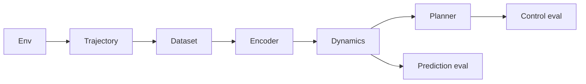

# Architecture

WorldForge is a latent world model for a scientific dynamics sandbox. The
target pipeline learns a compact state from trajectories, rolls it forward,
plans with that model, and scores prediction and control offline. The
environment, the trajectory record, and an offline dataset builder are in
the tree. The encoder, dynamics model, trainer, planner, eval harness, and
HTTP API are later days.

## Components

| Component | Shipped | Later |
| --- | --- | --- |
| Env | Shipped. Default `lotka_volterra`. | More environments can register behind the same reset/step protocol. |
| Dataset | Shipped. Corpus JSONL, per-episode JSON, manifest, train/val/test split, replay batch. | Training still consumes the batch later. |
| Encoder | Not started. | Map an observation to a compact latent. |
| Dynamics | Not started. | One-step latent transition, then multi-step rollout loss. |
| Planner | Not started. | Model-based action search. |
| Eval | Not started. | Open-loop prediction error and offline control return. |

Collection and the unit tests stay offline. There is no FastAPI app and no paid API.

## Default environment

The default system is nondimensional Lotka-Volterra predator-prey kinetics
with a clipped dose on each species. The state is two positive numbers, so
a rollout is fast and a JSON trajectory stays small. With unit rates the
coexistence equilibrium is `(1, 1)`. The uncontrolled vector field is a
family of cycles around that point, which is enough structure for a later
latent model to fit. The dose is the control: positive stocks a species,
negative harvests it. The reward is the negative L1 distance from the
equilibrium. That is a placeholder regulation objective, not a learned
reward.

A Gray-Scott reaction-diffusion plate was the other candidate. It is not
the default. A plate, even a small one, has an observation made of a grid
channel for each species. Day 1 tests need a state small enough that a
seeded episode finishes well under a second. The schema stores a list of
floats, so a grid environment can be added later without a new file format.

Integration is classical RK4. One environment step is `0.2` time units,
split into four substeps. The dose is held constant across those substeps.
`reset(seed)` draws the initial population with `random.Random(seed)`. The
same seed and the same actions reproduce the same states.

`worldforge env-demo` is the smoke path. It rolls this environment and
prints the trajectory metadata (`env_id`, `seed`, `horizon`), the return,
the initial and final state, and a one-line ASCII summary.

## Trajectory record

`Observation`, `Action`, `Transition`, and `Trajectory` are frozen Pydantic
models. Extra fields are rejected. A trajectory's metadata is `env_id`,
`seed`, and `horizon`. `horizon` is the number of steps requested.
`transitions` is shorter when the episode ends first.

JSON is one document. Single-episode JSONL is one trajectory file: a `meta`
line, then one `transition` line per step. `rollout` builds a trajectory
with a zero dose, a seeded uniform dose, or an open-loop sine dose.
`sine_dose` scales a sine of the step index into the action bounds. Component
`i` has phase `i * pi / 2`. The period is 16 steps. The dose does not use
the seed.

## Corpus

`worldforge collect` writes a directory:

| File | Contents |
| --- | --- |
| `manifest.json` | Format `worldforge.corpus.v1`. `env_id`, requested `horizon`, and one record per episode: `index`, `seed`, `policy`, `steps`, and an optional relative `file`. Top-level `policy` is `mixed` when episodes differ. |
| `corpus.jsonl` | One trajectory JSON object per line (`env_id`, `seed`, `horizon`, `transitions`). Present when the jsonl format is requested. |
| `episodes/ep_XXXX.json` | One indented trajectory document per episode. Present when the json format is requested. |

`load_corpus` reads the directory (preferring `corpus.jsonl`), a corpus JSONL
file, a single-episode JSONL file, or one trajectory JSON file.
`split_trajectories` assigns episodes with the largest-remainder method and
shuffles a canonical order with `random.Random(seed)`. The same episodes and
the same seed produce the same train, val, and test tuples.
`sample_transition_batch` draws stored transitions without replacement. It
does not step the environment.

The golden set is `tests/fixtures/trajectories/`: six episodes, horizon 8,
seeds 0–5, policies `zero`, `random`, and `sine_dose`. Regenerate with
`python scripts/regenerate_fixtures.py` and commit the files. CI loads them
and does not rebuild them.

## Where later days attach

The encoder reads `Observation` from these corpora. The dynamics model
predicts the next observation, or a latent that decodes to it. The planner
proposes `Action` sequences. Prediction eval compares a rolled-out trajectory
with a held-out split. Control eval compares return against the zero dose
already used by `env-demo`. Those pieces are not in this revision.
