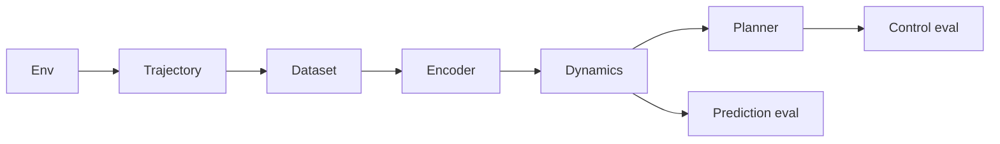

# Architecture

WorldForge is a latent world model for a scientific dynamics sandbox. The
target pipeline learns a compact state from trajectories, rolls it forward,
plans with that model, and scores prediction and control offline. Day 1
ships the environment and the trajectory record those later pieces will
read. It does not ship an encoder, a dynamics model, a trainer, a planner,
an eval harness, or an HTTP API.

## Components

| Component | Day 1 | Later |
| --- | --- | --- |
| Env | Shipped. Default `lotka_volterra`. | More environments can register behind the same reset/step protocol. |
| Dataset | Schema plus one-episode rollout to JSON and JSONL. | A replay corpus and batch sampler. |
| Encoder | Not started. | Map an observation to a compact latent. |
| Dynamics | Not started. | One-step latent transition, then multi-step rollout loss. |
| Planner | Not started. | Model-based action search. |
| Eval | Not started. | Open-loop prediction error and offline control return. |

Day 1 stays offline. There is no FastAPI app and no paid API.

## Default environment

The default system is nondimensional Lotka-Volterra predator-prey kinetics
with a clipped dose on each species. The state is two positive numbers, so
a rollout is fast and a JSON trajectory stays small. With unit rates the
coexistence equilibrium is `(1, 1)`. The uncontrolled vector field is a
family of cycles around that point, which is enough structure for a later
latent model to fit. The dose is the control: positive stocks a species,
negative harvests it. The reward is the negative L1 distance from the
equilibrium. That is a placeholder regulation objective, not a learned
reward.

A Gray-Scott reaction-diffusion plate was the other candidate. It is not
the default. A plate, even a small one, has an observation made of a grid
channel for each species. Day 1 tests need a state small enough that a
seeded episode finishes well under a second. The schema stores a list of
floats, so a grid environment can be added later without a new file format.

Integration is classical RK4. One environment step is `0.2` time units,
split into four substeps. The dose is held constant across those substeps.
`reset(seed)` draws the initial population with `random.Random(seed)`. The
same seed and the same actions reproduce the same states.

`worldforge env-demo` is the smoke path. It rolls this environment and
prints the trajectory metadata (`env_id`, `seed`, `horizon`), the return,
the initial and final state, and a one-line ASCII summary.

## Trajectory record

`Observation`, `Action`, `Transition`, and `Trajectory` are frozen Pydantic
models. Extra fields are rejected. A trajectory's metadata is `env_id`,
`seed`, and `horizon`. `horizon` is the number of steps requested.
`transitions` is shorter when the episode ends first.

JSON is one document. JSONL is one trajectory file: a `meta` line, then one
`transition` line per step. `rollout` builds a trajectory from an
environment with either a zero dose or a seeded uniform dose.

## Where later days attach

The dataset day reads these JSONL files. The encoder reads `Observation`.
The dynamics model predicts the next observation, or a latent that decodes
to it. The planner proposes `Action` sequences. Prediction eval compares a
rolled-out trajectory with a held-out one. Control eval compares return
against the zero dose already used by `env-demo`. None of that is
implemented in this revision.
