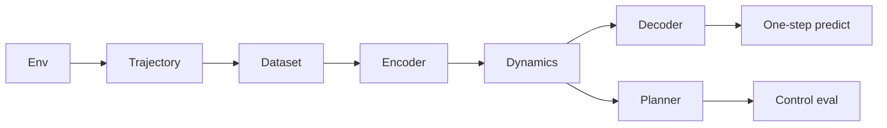

# Architecture

WorldForge is a latent world model for a scientific dynamics sandbox. The
target pipeline learns a compact state from trajectories, rolls it forward,
plans with that model, and scores prediction and control offline. The
environment, the trajectory record, an offline dataset builder, and a Day 3
latent model are in the tree. The training loop, planner, eval harness, and
HTTP API are later days.

## Components



| Component | Shipped | Later |
| --- | --- | --- |
| Env | Shipped. Default `lotka_volterra`. | More environments can register behind the same reset/step protocol. |
| Dataset | Shipped. Corpus JSONL, per-episode JSON, manifest, train/val/test split, replay batch. | The training loop still consumes the batch later. |
| Encoder | Shipped. Deterministic MLP, observation to latent `z`. | A stochastic encoder would belong to the reserved RSSM variant. |
| Dynamics | Shipped. Day 3 baseline: deterministic residual MLP, `(z, a) -> z_next`. | `dynamics="rssm"` is reserved and raises `NotImplementedError`. Multi-step rollout loss is later. |
| Decoder | Shipped. Small MLP, latent to reconstructed observation. | Prediction MSE uses it; the loss itself is not in this revision. |
| World model | Shipped. `encode`, `step`, `decode`, `predict`, and `forward`. Checkpoint directory with `config.json` and `weights.pt`. | No optimizer and no training loop. |
| Planner | Not started. | Model-based action search. |
| Eval | Not started. | Open-loop prediction error and offline control return. |

Collection and the unit tests stay offline. They do not download a dataset or a
pretrained weight file. Model tests need the optional `ml` extra (`torch` and
`numpy`). CI installs a CPU build of torch before that extra. There is no
FastAPI app and no paid API. There is no training loop in this revision.

## Default environment

The default system is nondimensional Lotka-Volterra predator-prey kinetics
with a clipped dose on each species. The state is two positive numbers, so
a rollout is fast and a JSON trajectory stays small. With unit rates the
coexistence equilibrium is `(1, 1)`. The uncontrolled vector field is a
family of cycles around that point, which is the structure the latent
model is meant to fit. The dose is the control: positive stocks a species,
negative harvests it. The reward is the negative L1 distance from the
equilibrium. That is a placeholder regulation objective, not a learned
reward.

A Gray-Scott reaction-diffusion plate was the other candidate. It is not
the default. A plate, even a small one, has an observation made of a grid
channel for each species. Day 1 tests need a state small enough that a
seeded episode finishes well under a second. The schema stores a list of
floats, so a grid environment can be added later without a new file format.

Integration is classical RK4. One environment step is `0.2` time units,
split into four substeps. The dose is held constant across those substeps.
`reset(seed)` draws the initial population with `random.Random(seed)`. The
same seed and the same actions reproduce the same states.

`worldforge env-demo` is the smoke path. It rolls this environment and
prints the trajectory metadata (`env_id`, `seed`, `horizon`), the return,
the initial and final state, and a one-line ASCII summary.

## Trajectory record

`Observation`, `Action`, `Transition`, and `Trajectory` are frozen Pydantic
models. Extra fields are rejected. A trajectory's metadata is `env_id`,
`seed`, and `horizon`. `horizon` is the number of steps requested.
`transitions` is shorter when the episode ends first.

JSON is one document. Single-episode JSONL is one trajectory file: a `meta`
line, then one `transition` line per step. `rollout` builds a trajectory
with a zero dose, a seeded uniform dose, or an open-loop sine dose.
`sine_dose` scales a sine of the step index into the action bounds. Component
`i` has phase `i * pi / 2`. The period is 16 steps. The dose does not use
the seed.

## Corpus

`worldforge collect` writes a directory:

| File | Contents |
| --- | --- |
| `manifest.json` | Format `worldforge.corpus.v1`. `env_id`, requested `horizon`, and one record per episode: `index`, `seed`, `policy`, `steps`, and an optional relative `file`. Top-level `policy` is `mixed` when episodes differ. |
| `corpus.jsonl` | One trajectory JSON object per line (`env_id`, `seed`, `horizon`, `transitions`). Present when the jsonl format is requested. |
| `episodes/ep_XXXX.json` | One indented trajectory document per episode. Present when the json format is requested. |

`load_corpus` reads the directory (preferring `corpus.jsonl`), a corpus JSONL
file, a single-episode JSONL file, or one trajectory JSON file.
`split_trajectories` assigns episodes with the largest-remainder method and
shuffles a canonical order with `random.Random(seed)`. The same episodes and
the same seed produce the same train, val, and test tuples.
`sample_transition_batch` draws stored transitions without replacement. It
does not step the environment.

The golden set is `tests/fixtures/trajectories/`: six episodes, horizon 8,
seeds 0–5, policies `zero`, `random`, and `sine_dose`. Regenerate with
`python scripts/regenerate_fixtures.py` and commit the files. CI loads them
and does not rebuild them.

## Latent model

`src/worldforge/models/` is the Day 3 forward path. It does not step the
environment and it does not update parameters.

`ModelConfig` is a frozen Pydantic model and does not import PyTorch.
Defaults match Lotka-Volterra: `obs_dim=2`, `action_dim=2`, `latent_dim=8`,
`hidden_dim=64`. `encoder_hidden_layers` defaults to 2, `dynamics_hidden_layers`
to 2, and `decoder_hidden_layers` to 1. Those depths are stored in the
checkpoint so a later load rebuilds the same MLPs.

`WorldModel(config, seed=...)` builds three modules on CPU in float32, in
order:

| Module | Map | Default shape |
| --- | --- | --- |
| Encoder | observation to `z` | `Linear(2, 64) -> ReLU -> Linear(64, 64) -> ReLU -> Linear(64, 8)` |
| Dynamics | `(z, action)` to `z_next` | residual `Linear(10, 64) -> ReLU -> Linear(64, 64) -> ReLU -> Linear(64, 8)` |
| Decoder | `z` to observation | `Linear(8, 64) -> ReLU -> Linear(64, 2)` |

The dynamics baseline is

```text
z_{t+1} = z_t + mlp(concat(z_t, a_t))
```

The same latent and the same action always produce the same next latent.
There is no dropout, so `train()` and `eval()` match. `seed` draws every
linear map from a private generator. Construction restores PyTorch's global
CPU generator.

`forward(observation, action)` returns a `StepPrediction`: `latent` (`z_t`),
`next_latent` (`z_{t+1}`), `reconstructed` (`decode(z_t)`), and
`predicted_observation` (`decode(z_{t+1})`). `predict` returns only the
one-step observation. Leading tensor dimensions are a batch. The last
dimension is the feature width. Inputs are floating tensors; the modules
cast them to float32.

`build_dynamics` is the extension point. `ModelConfig.dynamics` may be
`mlp` or `rssm`. `mlp` is this baseline. `rssm` is the name reserved for a
later stochastic recurrent state-space model and raises
`NotImplementedError` at construction. A future variant should keep
`forward(latent, action) -> next_latent` so `WorldModel.step` stays the
training call site.

`save_checkpoint(path, model)` writes a directory:

| File | Contents |
| --- | --- |
| `config.json` | Format `worldforge.checkpoint.v1`, the package version, and the `ModelConfig` JSON. No optimizer state and no credentials. |
| `weights.pt` | The module `state_dict` only. |

`load_checkpoint` rebuilds the modules from that config and loads the
weights onto CPU. The init seed is not stored.

`worldforge model-info` prints the shapes and parameter counts.
`worldforge forward-smoke` runs one encode / step / decode. With no
`--fixture` it uses the coexistence state `(1, 1)` and a zero dose. With
`--fixture` it reads one stored transition from a corpus or a trajectory
file. Neither command trains.

Importing `worldforge` or `worldforge.models.config` does not import
PyTorch. `from worldforge.models import WorldModel` does, and needs the
`ml` extra.

## Where later days attach

Day 4 can call `WorldModel.forward` or `predict` on a
`sample_transition_batch`, score `reconstructed` against the current
observation and `predicted_observation` against the next observation, and
write the result with `save_checkpoint`. That loop is not in this revision.
The planner still proposes `Action` sequences. Prediction eval still
compares a rolled-out trajectory with a held-out split. Control eval still
compares return against the zero dose already used by `env-demo`.
